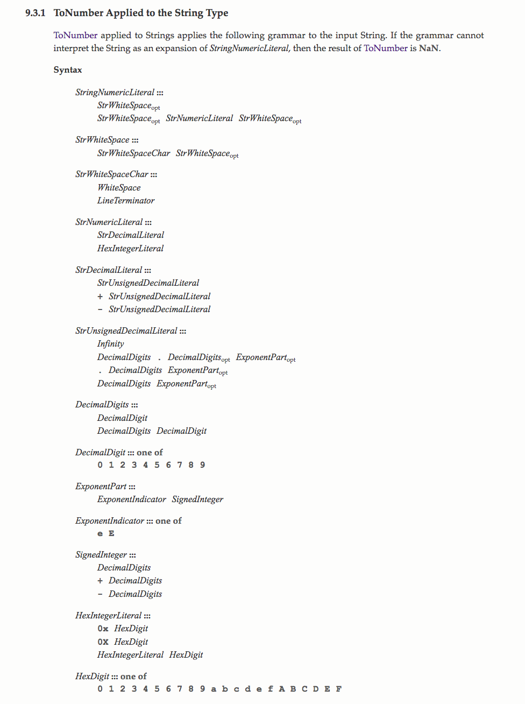
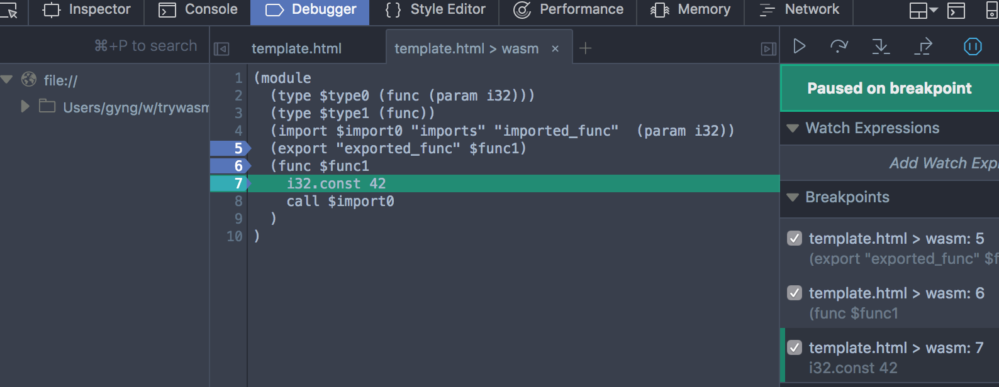

<!-- $theme: default -->

<!-- page_number: true -->

# What is WebAssembly?
May 2017
https://github.com/gyng/wasm-experiments


---

# What it looks like (wasm)

```text
0061 736d 0100 0000 0108 0260 017f 0060
0000 0219 0107 696d 706f 7274 730d 696d
706f 7274 6564 5f66 756e 6300 0003 0201
0107 1101 0d65 7870 6f72 7465 645f 6675
6e63 0001 0a08 0106 0041 2a10 000b 
```

---

# Text format (was?t)

```lisp
(module
  (func $i (import "imports" "imported_fn") (param i32))
  (func (export "exported_fn")
    i32.const 42
    call $i))
```

s-expressions, also used by LISP

---

# Another example

```c
int main() {
  printf("Hello, world!\n");
  return 0;
}
```
<small>emcc hello.c -s WASM=1 -o hello.html</small>

---

# Why WASM?

## JS is slow*

- [Current engines](https://www.youtube.com/watch?v=N4-Rh6fd3ic) are [pretty fast](https://blog.mozilla.org/javascript/2016/07/05/ionmonkey-evil-on-your-behalf/), but&hellip;
- Verbose text representation
- Dynamic, lots of type coercion everywhere
- Garbage collection
- JS engine optimisations can only do so much (and take time)

## Plugins are dead and unsafe
- ActiveX, Java, Flash, Silverlight
- Not on mobile

---

```js
a + b;
```

---

# Slow!


>11.4.6 Unary + Operator
>
>The unary + operator converts its operand to Number type.
>
>The production UnaryExpression : + UnaryExpression is evaluated as follows:
>
>1. Let expr be the result of evaluating UnaryExpression.
>2. Return <span style="color: red; font-weight: bold; text-decoration: underline">ToNumber</span>(GetValue(expr)). 

---

Think of what the JIT compiler has to do to optimise `+`

<div style="overflow: hidden; max-height: 40vh">
  
</div>

<small>https://www.ecma-international.org/ecma-262/5.1/#sec-9.3.1</small>

---

# x86 assembly

```x86
addl %edx, %eax
```

---

# WASM is 1.2&times; slower than native<sup>1</sup>

1: [Google/Alex Danilo estimate/real-life testing](https://www.youtube.com/watch?v=6v4E6oksar0)

---

Compared to JS,

## Right now, WASM can be faster *sometimes**

<small>*toy examples with emscripten, see `../src`</small>

---

# Intended as a compiler target

## Hand-coding non-trivial programs unrealistic

---

# WASM compile chain

|Human| <span style="color:red">C, C++, Rust</span> | <span style="color:red">TypeScript, WAT</span> |
|-:|:-|:-|
|⇓| *clang, gcc, rustc*| ⇓ |
|IR | <span style="color:red">**LLVM**</span> | ⇓ |
|⇓| *emscripten, wabt* | ⇓ |
|Bytecode | <span style="color:red">**WASM**</span> | <span style="color:red">**WASM**</span>
|⇓| *browsers*
| Machine | <span style="color:red">**x86, ARM**</span> |

---

# Rust example

```rust
#[no_mangle]
pub fn fact(n: i32) -> i32 {
  if n == 0 {
    return 1;
  }

  // added safety: panics on overflow!
  n.checked_mul(fact(n - 1)).unwrap()
}
```

<small>rustc --target=wasm32-unknown-emscripten fact_rs.rs -O -o fact_rs.html</small>

---

# WASM feature set

|                           |                                                 |
|---------------------------|-------------------------------------------------|
| Types                     | `i32` `i64` `f32` `f64`                      |
| Functions<sup>1</sup>    | Single function table, indirect calls via table |
| Memory<sup>2</sup>       | Single linear, bounds-checked array             |
| Operations                | `+` `-` `*` `/` `%` `&` `<` `<<`  `==` `ceil` `abs` etc.     |
| Control flow              | `if` `loop` `block` `br` `switch` etc.           |

<small>
1: <a href="https://webassembly.org/docs/security/">https://webassembly.org/docs/security/</a>

2: https://youtu.be/6v4E6oksar0?t=1082
</small>

---

# WASM JS API

* [Module](https://developer.mozilla.org/en-US/docs/Web/JavaScript/Reference/Global_Objects/WebAssembly/Module)
* [Instance](https://developer.mozilla.org/en-US/docs/Web/JavaScript/Reference/Global_Objects/WebAssembly/Instance)
* [Memory](https://developer.mozilla.org/en-US/docs/Web/JavaScript/Reference/Global_Objects/WebAssembly/Memory)
* [Table](https://developer.mozilla.org/en-US/docs/Web/JavaScript/Reference/Global_Objects/WebAssembly/Table)
* CompileError, LinkError, RuntimeError

---

# Module, Instance

## Modules
Stateless, compiled WASM code

```js
new WebAssembly.Module(bufferSource);
```

## Instance
Stateful, executable instance of a module

```js
new WebAssembly.Instance(module, importObject);
```

---

# Module, Instance

```javascript
const importObject = {
  imports: {
    imported_fn: arg => console.log(arg) // pass to wasm
  }
};

// fetchAndInstantiate
const wasmFunc = fetch('simple.wasm')
  .then(res =>
    res.arrayBuffer())
  .then(bytes =>
    // Create an instance directly
    WebAssembly.instantiate(bytes, importObject))
  .then(results =>
    results.instance.exports.exported_fn);

wasmFunc() // 42
```

---

# simple.wat

```
(module
  (func $i (import "imports" "imported_fn") (param i32))
  (func (export "exported_fn")
    i32.const 42
    call $i)) ;; () => console.log(42)
```

<small>./wast2wasm simple.wat -o simple.wasm</small>

---

# memory.html

```
fetchAndInstantiate('memory.wasm')
  .then((instance) => {
    const buffer = instance.exports.mem.buffer;
    const arr = new Uint32Array(buffer);

    for (let i = 0; i < 10; i++) {
      arr[i] = i;
    }

    // 0 + 1 + ... + 8 + 9
    const sum = instance.exports.accumulate(0, 10);
    
    console.log(sum) // 45
  });
```

---

# memory.wat

```
(module
  (memory (export "mem") 1)
  (func (export "accumulate") (param $ptr i32) (param $len i32) (result i32)
    (local $end i32)
    (local $sum i32)

    (set_local $end (i32.add (get_local $ptr) (i32.mul (get_local $len) (i32.const 4))))

    (block $break (loop $top
      (br_if $break (i32.eq (get_local $ptr) (get_local $end)))
      (set_local $sum (i32.add (get_local $sum)
                               (i32.load (get_local $ptr))))
        (set_local $ptr (i32.add (get_local $ptr) (i32.const 4)))
        (br $top)
    ))

    (get_local $sum)
  )
)
```

---

# C pseudocode

```c
int accumulate(int *ptr, int len) {
  int *end = ptr + len * sizeof(int);
  int sum = 0;

  while (ptr != end) {
    sum += *ptr;
    ptr += sizeof(int);
  }

  return sum;
}
```

---

# String == char[]

Can use experimental [TextDecoder API](https://developer.mozilla.org/en-US/docs/Web/API/TextDecoder/decode) for easier encoding/decoding

---

# Table

Similar to memory, sharing an array of function pointers

---


# WASM support


* Chrome 57
* Firefox 52
* Edge 15 (flag)
* Safari technology preview
* Node
* ~~iOS~~
* ~~IE~~

https://caniuse.com/#feat=wasm

---

# Browser developer tools



Breakpoints, text-format source (Firefox Developer Edition)

---

# Tools

* llvm
* [emscripten](https://github.com/kripken/emscripten)
* [wabt](https://github.com/WebAssembly/wabt)

---

# ~~asm.js~~

* Before WASM
* Subset of JS
* Hints for browser JS engines
* Still goes through JS engine

```
function add(x) {
  x = x|0; // |0 = int
  return (x + 1)|0; // int
}
```

---

# emscripten

## LLVM to JS

* asm.js or webasm
* adds a bunch of glue code to make things *just work*

```text
git clone https://github.com/juj/emsdk.git
cd emsdk

./emsdk install --build=Release sdk-incoming-64bit \
  binaryen-master-64bit

./emsdk activate --global --build=Release \
  sdk-incoming-64bit binaryen-master-64bit

source ./emsdk_env.sh
emcc hello.c -s WASM=1 -o hello.html
```

---

# wabt

## WebAssembly Binary Toolkit

Utilities for working with wasm files

```text
git clone --recursive https://github.com/WebAssembly/wabt
cd wabt
make

./wast2wasm simple.wat -o simple.wasm
```

---

# rustc

```text
curl https://sh.rustup.rs -sSf | sh
rustup install stable
rustup default stable
rustup target add wasm32-unknown-emscripten

rustc --target=wasm32-unknown-emscripten \
  app.rs -O -o app.html
```

---

# Yes, we can interact with the DOM&hellip;

```c
#include <emscripten.h>

int main() {
  EM_ASM(
    const el = document.getElementById('hello');
    el.innerText = 'Hello, world!';
  );

  return 0;
}
```
<small>emcc hello.c -o hello.html</small>

&hellip;and any [Web API](https://developer.mozilla.org/en/docs/Web/API) (with overhead)

---

# Using Web Audio API with emscripten

```c
#include <emscripten/emscripten.h>
int EMSCRIPTEN_KEEPALIVE main() {
  int i = 200;
  EM_ASM_({
    const context = new AudioContext;
    window.oscillator = context.createOscillator();
    window.oscillator.frequency.value = $0;
    window.oscillator.connect(context.destination);
    window.oscillator.start(0);
  }, i);
  for (; i < 2000; i++) {
    EM_ASM_({
      window.oscillator.frequency.value = $0;
    }, i);
    emscripten_sleep(10);
  } 
  return 0;
}
```
<small>emcc audio.c -s EMTERPRETIFY=1 -s EMTERPRETIFY_ASYNC=1 -o audio.html</small>

---

# The future

* Reduced overhead between JS⇆WASM
* Direct DOM access
* [SharedArrayBuffer](https://developer.mozilla.org/en-US/docs/Web/JavaScript/Reference/Global_Objects/SharedArrayBuffer)
* SIMD from WASM
* Exception handling
* Garbage collection
* First class WASM modules (npm for wasm?)
* Better devtools

<small>1. https://hacks.mozilla.org/2017/02/where-is-webassembly-now-and-whats-next/</small>

---

# Demos and projects

* http://mbebenita.github.io/WasmExplorer/
* https://github.com/shamadee/web-dsp
* http://webassembly.org/demo/
* https://s3.amazonaws.com/mozilla-games/ZenGarden/EpicZenGarden.html
* http://www.hellorust.com/emscripten/
* https://github.com/google/draco/

---

# References

* https://developer.mozilla.org/en-US/docs/WebAssembly/Concepts
* https://hacks.mozilla.org/category/a-cartoon-intro-to-webassembly/
* http://webassembly.org/docs/semantics/
* https://webassembly.github.io/spec/
* https://github.com/mdn/webassembly-examples
* https://www.youtube.com/watch?v=6v4E6oksar0
* https://www.ecma-international.org/ecma-262/5.1/
* https://hackernoon.com/compiling-rust-to-webassembly-guide-411066a69fde
* https://www.slideshare.net/RReverser/rust-javascript
* https://kripken.github.io/emscripten-site/docs/api_reference